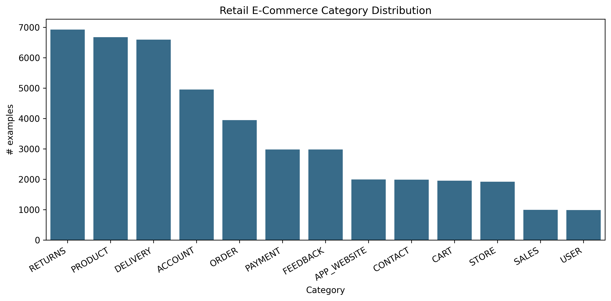
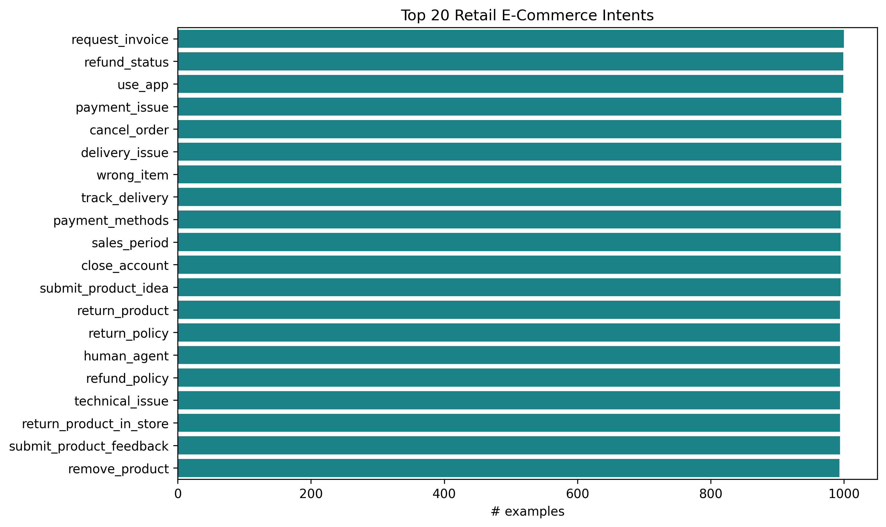
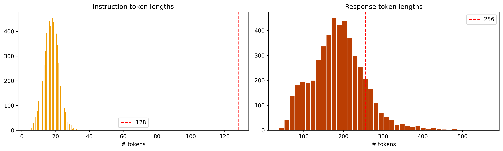
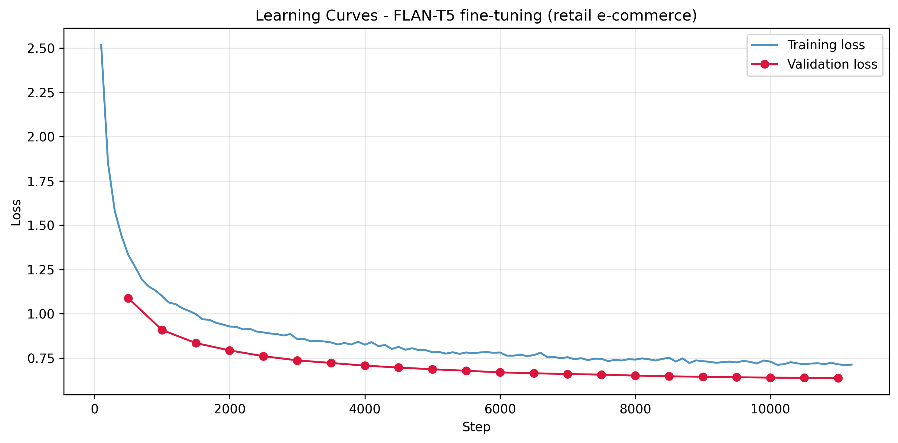
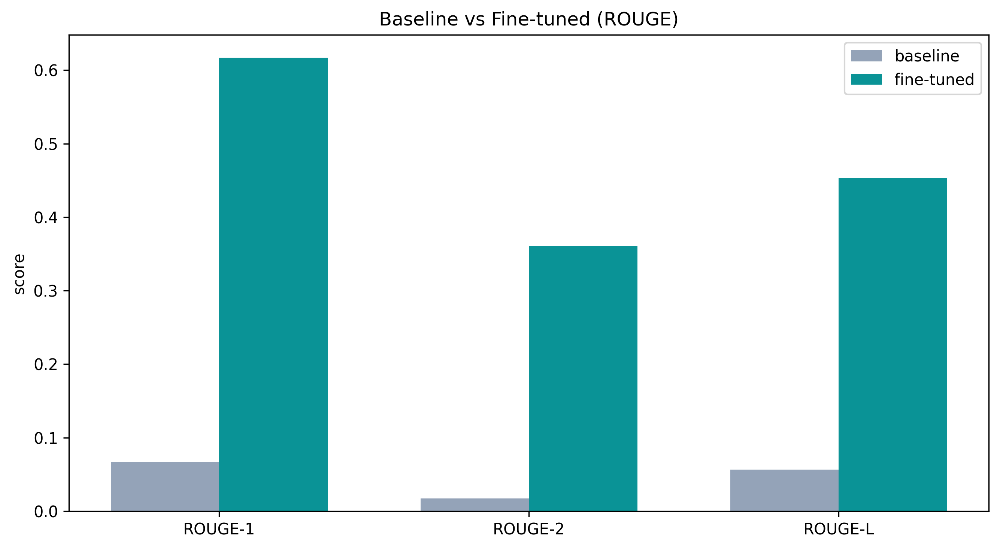
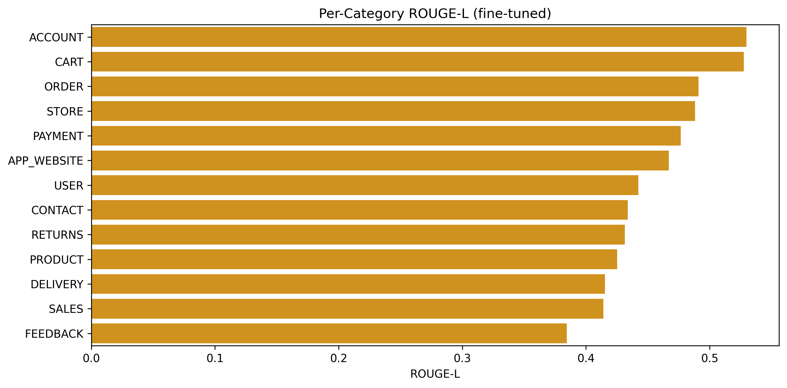
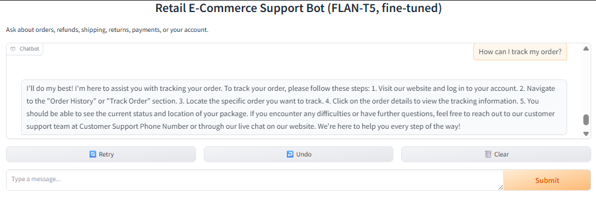
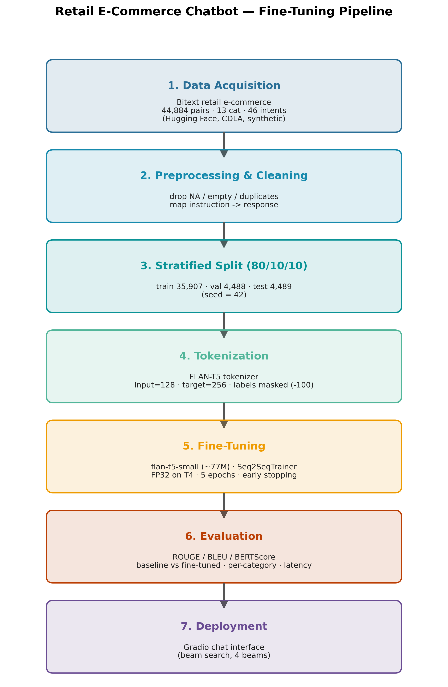

<!--
  HUMANIZED DRAFT — rewritten in a more natural, first-person voice (less uniform rhythm,
  AI-tell phrases removed, fewer em-dashes), grounded in the real experiment.
  ⚠️ Harish should STILL do a final personalize pass in his own words and run AI + plagiarism
  detectors (GPTZero / ZeroGPT / Quetext etc.) before submission. Numbers and citations are real.
  Structure (headings/figures/tables/code/refs) is unchanged so build_paper_docx.py still works.
-->

# Fine-Tuning a Compact Instruction-Tuned Language Model for Retail E-Commerce Customer-Support Conversational AI

**Author:** Harish Chandra
**Affiliation:** Master's in CS: Artificial Intelligence and Machine Learning, Woolf University
**Date:** 31 May 2026

---

## Abstract

Run an online store for any length of time and the same support questions keep landing in the inbox: where is my order, how do I return this, can I get a refund. Handling that volume with people alone is expensive. Large language models can answer such questions well, but they are big and costly to run, which puts them out of reach for a lot of small and mid-sized retailers. In this paper I ask a simple question: can a small instruction-tuned model be fine-tuned to give accurate, on-topic support answers while running on a single free-tier GPU? To find out, I fine-tuned `google/flan-t5-small` (about 77M parameters) on the Bitext retail e-commerce support dataset, which holds 44,884 instruction–response pairs across 13 categories and 46 intents, training in full precision on a Google Colab T4. I then compared the fine-tuned model with the un-tuned baseline on a held-out test set using ROUGE, BLEU, and BERTScore, and looked at how it did category by category.

The jump was big. ROUGE-L went from 0.057 to 0.453, about eight times higher; BLEU rose from 0.0 to 29.27; and BERTScore-F1 moved from 0.818 to 0.909. Answers that had averaged a useless seven words grew to a full 133 words of step-by-step guidance. Order, account, and cart questions came out best, feedback worst. One failure stood out: ask it something with nothing to do with retail support and it still answers like a support agent, never noticing the question is off-topic. The headline, then, is simple. A small model that costs almost nothing to train covers most routine retail support, which makes it a sensible, reproducible starting point for low-resource conversational AI. I also discuss where it falls short and the safeguards a real deployment would need.

## Index Terms

Conversational AI, Large Language Models, Fine-tuning, FLAN-T5, Sequence-to-sequence Learning, Retail E-Commerce, Customer Support, Natural Language Processing, Low-resource NLP.

---

## I. Introduction

### I.1 Background and Motivation

Talking to a bot for customer service used to feel like a gimmick. Not any more. The global chatbot market was worth roughly USD 7.76 billion in 2024 and is on track for about USD 27.29 billion by 2030, with customer service already the single biggest slice of it [10]. The surveys say the same thing: most people have dealt with a support chatbot in the past year, and these bots now settle a good share of routine questions with no human in the loop [16]. None of this happened overnight. It rests on a decade of progress in deep learning for language, starting with the transformer [1], moving through text-to-text transfer models like T5 [2], and arriving at instruction tuning, which teaches a model to follow plain-English requests [3]. Platforms such as Hugging Face now give anyone free access to these pre-trained models, so building a domain-specific assistant is no longer the preserve of big labs.

Retail is a natural fit. Online shopping throws off a steady stream of support requests, and most are predictable repeats: where is my order, how do I return this, how do I get a refund. Shoppers want an answer now, whatever the hour, and covering that with people alone is both slow and costly. The problem I care about is the cost gap. Large proprietary models can answer these questions, but they are expensive to run, which rules them out for many smaller retailers. A small model that is cheap to fine-tune and runs on ordinary hardware would put the same capability within reach.

There is a second reason to focus on small models. Most recent attention has gone to scale, to ever-larger models trained on ever more data. Scale is not free, though. It costs latency, hosting, and energy, and it usually means sending customer data to a third-party API, which is awkward for a retailer that has to answer for how that data is handled. Yet many support tasks are narrow and well defined. For those, a small model that has been specialised by fine-tuning might deliver everything that matters in production without the overhead of a giant general-purpose system. That is the proposition I set out to test, concretely and reproducibly.

### I.2 Research Problem

Most impressive demonstrations of support chatbots lean on very large models or proprietary data and infrastructure. That leaves an open and genuinely practical question: how well can a *small*, openly available model do on a real domain task once it has been fine-tuned under tight compute limits? If a small model does the job, it is reproducible, cheap to retrain, and easy to deploy without special hardware. Whether it actually produces answers that are accurate and relevant enough to be useful is not obvious before you try it.

So the central research question of this paper is this: can a compact instruction-tuned model, `flan-t5-small`, be fine-tuned on retail e-commerce support data to give accurate, contextually relevant answers while staying within the limits of a single free-tier GPU? Two follow-up questions come with it. How big is the improvement over the un-tuned baseline, and which kinds of customer intent does the model handle well or badly?

### I.3 Research Objectives

I had five goals going in. Build a clean, reproducible fine-tuning pipeline for retail support data. Fine-tune flan-t5-small on it inside a single-GPU, 25-epoch budget. Score the result against the un-tuned baseline with ROUGE, BLEU, and BERTScore on a held-out test set. Then break those scores down by intent category and actually read the outputs, so I could see where the model holds up and where it falls over. And last, wrap the trained model in a simple chat interface as a proof of concept.

Why does this matter? On the academic side, it adds evidence about whether low-resource, domain-specific conversational AI is feasible, which cuts against the usual push toward scale. On the practical side, it gives a small or mid-sized retailer a clear, cheap template for automating a good chunk of their support load, along with an honest account of the limits and safeguards such a system needs before it goes live.

The rest of the paper is laid out as follows. Section II looks at the retail e-commerce industry: its support structure, the rise of conversational AI, and the market and regulatory backdrop that sets the requirements for a deployable assistant. Section III reviews the related literature, from transformer and text-to-text foundations through instruction tuning, tokenization, efficient adaptation, and applied chatbot research, and pins down the gap I am filling. Section IV is the methodology, covering data, preprocessing, tokenization, the fine-tuning setup, inference, deployment, and the evaluation metrics. Section V reports the experiments and results, including the comparison with the baseline, the per-category and qualitative analysis, an error analysis, and threats to validity. The Discussion interprets all of it, and the Conclusion sums up the contribution and points to future work.

---

## II. Industry Analysis

### II.1 Overview of the Retail E-Commerce Landscape

Retail e-commerce is one of the biggest and fastest-growing parts of the world economy, with online retail revenue in the trillions of dollars and double-digit annual growth as hundreds of millions of new shoppers come online [11]. That growth reshapes customer service. Each new order, return, or delivery spawns its own support contacts, so the support load tracks sales almost one for one. And because the channel is fiercely competitive and largely self-service, how fast and how well you answer feeds straight into conversion, retention, and what people think of the brand.

Demand also never really stops. People shop at midnight and across time zones, and they expect help whenever they happen to need it, not just between nine and five. Staffing that with humans alone is expensive and hard to scale, and that, more than anything, is why automation has gone from a nice-to-have to a priority.

### II.2 Support Structure and Challenges

A handful of request types do most of the work in e-commerce support, and the dataset I used mirrors that. Its 44,884 queries sit in just 13 categories, including ORDER, RETURNS, PAYMENT, DELIVERY, CART, ACCOUNT, and PRODUCT, and 46 narrower intents such as track_order, cancel_order, get_refund, change_shipping_address, and place_order. Since the volume bunches up in a few predictable intents, a lot of those contacts could, in principle, be automated.

The pain points are just as obvious. Volumes are high and spiky, answers have to stay consistent across a whole team, the service has to run day and night, and money is always tight. Human-only operations feel all of that at once: hiring and training cost a lot, quality wanders from one agent to the next, and round-the-clock cover is hard to sustain. Put together, it is a strong case for letting an automated system take the routine, well-structured queries and saving people for the messy, sensitive, or high-value ones that genuinely need a human.

### II.3 Rise of AI in E-Commerce Support

Conversational AI has become the main answer to these pressures. Adoption has shot up: the chatbot market has grown several times over in a few years, customer service is its largest application, and most consumers now say they have used a support chatbot [10], [16]. Research has shifted along with practice, moving away from rule-based and retrieval systems toward fine-tuned transformers and generative assistants, with recent work aimed squarely at intent understanding and FAQ handling in customer care [7], [8]. The direction of travel is clear: from scripted flows toward models that read a free-text request and write a fluent, relevant reply.

This matters to retailers because a fine-tuned generative model copes with the many ways customers phrase the same request, instead of relying on exact keyword matches. Studies of customer feedback and support in e-commerce report that transformer models perform strongly and adapt to a new domain with relatively little data [7]. My work sits right in this line, but I take it to the low-cost extreme by deliberately choosing the smallest practical model.

### II.4 Business Value and Industry Requirements

For an online retailer the payoff from a good assistant is tangible. Soak up the routine, repetitive questions and you cut cost per contact, answer almost instantly, keep replies consistent, and ride out demand spikes without hiring in proportion, all while leaving agents free for the cases that need empathy and judgement. Quicker, steadier support also nudges conversion and retention upward, so the assistant brings in revenue and not just savings.

Delivering that value comes with requirements, though. An industry-grade assistant has to be accurate and relevant on the domain's intents, fast and predictable, affordable to build and run, and safe when it meets an out-of-scope or sensitive request. This study tackles the first three head-on by showing accurate, relevant answers from a cheap single-GPU model. The fourth shows up as a real limitation: a model fine-tuned narrowly will answer confidently even when the question is outside its domain. That gap between strong in-domain performance and unsafe out-of-domain behaviour is the thread I pick up later in the paper.

### II.5 Market Dynamics and Current Trends

A few trends line up to make this a good moment for small support assistants. Expectations have tilted hard toward instant self-service; most shoppers would rather sort a simple problem out themselves than sit in a queue, and a slow or patchy experience just sends them to an abandoned cart. Support now runs across more channels than ever, web chat, mobile apps, messaging, social media, so the same intents have to be answered the same way in every one of them, which favours a single model over a stack of hand-written scripts. And the open-model world has matured: strong pre-trained models and ready-made datasets are free under permissive licences, so the real barrier to entry is now not much more than a single GPU.

The economics push the same way. Retail margins are thin, support is a cost centre, and operators understand the value of automating a routine ticket. That creates real demand for solutions with a low total cost of ownership, not just good headline quality but cheap to train, host, monitor, and update as catalogues and policies change. A compact model that a small team can retrain on free or low-cost infrastructure fits those pressures neatly, which is why the low-resource angle of this study is commercially relevant and not just an academic constraint.

### II.6 Regulatory and Data-Governance Environment

Putting conversational AI into retail also means working inside a tightening set of rules. Data-protection law such as the GDPR, and its cousins elsewhere, dictates how customer data can be collected, processed, and stored, and it makes casually shipping personal information off to an outside model provider a risky move. Consumer-protection law piles on more: a retailer is on the hook for whatever its automated agent seems to promise, about refunds, delivery dates, or prices. So an assistant that sounds confident but gets it wrong is not just a quality issue, it is a compliance one.

These points shape what a responsible deployment looks like, and they reinforce two themes of this paper. Because the dataset I used is synthetic and openly licensed, the study itself touches no personal data and sidesteps privacy concerns at the research stage. And the option to fine-tune and host a small model in-house, rather than sending every query to an external API, is itself attractive for data governance. Seen this way, the out-of-scope behaviour I analyse later is as much a regulatory concern as a technical one, because it goes to whether an automated agent can be trusted to stay within what it is allowed to say.

### II.7 How This Research Addresses Industry Needs

Putting all of this together, the study is aimed at the requirements that matter most to a retailer with limited resources. It shows that the dominant, high-volume intents can be handled accurately by a cheap model; it measures the quality gain precisely so an operator can judge whether it is good enough; it reports per-category strengths and weaknesses so automation can be rolled out where it is safe and people kept where it is not; and it spells out the limitations and safeguards, out-of-scope detection and human fallback, that a compliant production system would need. The whole project is framed around the practical and regulatory realities of the industry it serves.

---

## III. Literature Review

### III.1 Overview

This paper builds on three lines of earlier work: the deep-learning architectures that make modern text generation possible, the instruction-tuning methods that get those architectures to follow user requests, and the applied research on conversational AI for customer service. I review each in turn, then look at how dialogue systems are evaluated, and finish by naming the gap I aim to fill. The goal here is not a complete survey but a focused account of what I build on and where I depart from it.

### III.2 Transformer and Text-to-Text Foundations

The transformer, introduced by Vaswani et al., dropped recurrence in favour of self-attention and became the backbone of essentially every large language model since, because it captures long-range dependencies and trains efficiently in parallel [1]. Raffel et al. built on it with the Text-to-Text Transfer Transformer, or T5, which recasts every NLP task, translation, summarisation, question answering, as turning one string into another [2]. That framing is exactly what I rely on: customer support is just a mapping from a customer's question to a support answer.

T5's encoder–decoder design suits this generation task well, since the decoder is conditioned on a full encoding of the input query. The family also comes in several sizes, and that is what makes a low-resource study like mine possible. The smallest variant keeps the same architecture and pre-training recipe as its larger siblings but fits comfortably on a single consumer GPU. I chose that smallest practical variant on purpose, to probe the bottom end of the compute–quality trade-off.

### III.3 Instruction Tuning and Compact Models

The big step on top of T5 is instruction tuning. Chung et al. showed that fine-tuning a model on a huge collection of tasks written as natural-language instructions, the FLAN recipe, sharply improves its ability to follow new instructions, even ones it has never seen [3]. The `flan-t5` models I use come out of that recipe, which is why even the un-tuned baseline can make a reasonable attempt at a support question, and why a fairly short domain fine-tune is enough to specialise it.

This matters for my research question because an instruction-tuned compact model starts from a much stronger place than a plain pre-trained model of the same size. Work on customer feedback and support modelling has reported the same thing: transformer models adapt to a new domain with relatively little data [7]. Put together, these results are the bet behind this study, that a small model which has already been instruction-tuned can be pushed to strong domain performance with a modest single-GPU fine-tune.

### III.4 Conversational AI in Customer Service and E-Commerce

Applied work on support chatbots has moved steadily from rule-based and retrieval systems toward learned, generative ones. Recent work on context-aware language understanding for customer-service chatbots fine-tunes transformers for intent classification and shows that adding contextual cues helps when a user's message is short or vague, which happens a lot in support [7]. Other recent work looks at putting generative assistants such as ChatGPT to work on FAQs, and walks through both the gains from fine-tuning and knowledge-base integration and the practical and ethical snags that come with it [8].

Across this literature the same point keeps coming up: fine-tuned transformers handle the many ways customers phrase a request and beat keyword-based methods, and domain adaptation buys large quality gains. But much of this work either focuses on one narrow sub-task, like intent classification, or leans on large generative models. My study complements it by fine-tuning a small end-to-end model that writes the whole support reply, and by reporting the trade-offs that come with that choice.

### III.5 Evaluation of Generative Dialogue Systems

Since support replies are generated text, I evaluate them with established automatic metrics. ROUGE measures n-gram and longest-common-subsequence overlap with a reference and is standard for summarisation and generation [12]; BLEU measures n-gram precision and comes from machine translation [13]. Both look only at surface overlap, so I pair them with BERTScore, which compares contextual embeddings and so gives credit to a correct answer worded differently from the reference [14]. Using all three paints a fuller picture than any one of them alone.

The literature is candid that these automatic metrics are stand-ins and do not fully capture whether a human finds an answer helpful or correct. So I pair them with a hands-on read of the model's outputs, which is common practice in applied dialogue work, and I treat the limits of automatic evaluation openly in the discussion.

### III.6 Subword Tokenization and Sequence-to-Sequence Learning

The text-to-text formulation rests on the sequence-to-sequence idea from Sutskever et al., where an encoder compresses an input sequence into a representation and a decoder expands it into an output sequence [17]. Modern systems do this with transformers rather than recurrent networks, but the framing, map a source sequence to a target sequence, is the same one I use to turn a query into a reply. How well these models work depends a lot on how text is split into tokens, since no fixed vocabulary can list every possible word.

Subword tokenization is the fix. Byte-pair encoding builds a vocabulary of frequent character sequences so rare or unseen words become combinations of known pieces [18], and SentencePiece turns this into a language-independent tokenizer that works straight on raw text [19]. FLAN-T5 uses a SentencePiece tokenizer, which is why it handles the product names, order codes, and placeholder slots in retail support text without drowning in out-of-vocabulary tokens. I kept that tokenizer as it came.

### III.7 Efficient and Low-Resource Model Adaptation

There is a growing body of work on adapting large models cheaply, and it speaks directly to my low-resource framing. Knowledge distillation and the release of deliberately small pre-trained variants make it possible to run capable models on modest hardware, and parameter-efficient methods such as Low-Rank Adaptation update only a small set of injected parameters instead of the whole network, which cuts the memory needed to specialise a model [20]. I take the simplest point on that spectrum, full fine-tuning of an already-small model, precisely because it is the clearest and most reproducible baseline for those efficiency techniques to be compared against later.

The other main alternative to fine-tuning is retrieval-augmented generation, which grounds a model at inference time on passages pulled from an external store [21], usually with dense sentence embeddings like Sentence-BERT's [22]. Retrieval cuts hallucination on knowledge-heavy queries and lets you update a system by editing the corpus instead of retraining. I deliberately leave retrieval out. The point of this study is to isolate and measure what fine-tuning alone gets a compact model on routine support intents, so retrieval stays a clearly marked direction for future work rather than a confound in this evaluation.

### III.8 Gaps in Existing Literature

Two gaps come out of this review. First, most demonstrations of strong support conversational AI lean on large or proprietary models, so the low-resource end of the design space, small, open, cheap-to-train models, is comparatively under-reported, and especially so for retail e-commerce. Second, a lot of applied work isolates a single sub-task such as intent detection rather than evaluating an end-to-end model that writes the full customer-facing reply, and it rarely reports per-category behaviour or the characteristic failure modes a practitioner needs to see coming.

### III.9 Contribution of This Study

This study goes after both gaps. I fine-tune a single, compact, openly available instruction-tuned model end-to-end on a retail e-commerce support corpus under a strict single-GPU budget, and I report the whole picture: the quantitative gains over the baseline across three complementary metrics, a per-category breakdown of where the model is strong and weak, and an honest look at how it behaves out of domain. The contribution, then, is a practical, reproducible reference point for low-resource domain conversational AI, not a new architecture.

---

## IV. Methodology

### IV.1 Data Acquisition

I used the Bitext retail e-commerce customer-support dataset, pulled from Hugging Face under the CDLA-Sharing-1.0 licence [9]. It holds 44,884 instruction–response pairs, each one a customer query paired with a support answer, and each tagged with one of 13 categories and one of 46 finer intents. The categories cover the full spread of e-commerce support, ACCOUNT, APP_WEBSITE, CART, CONTACT, DELIVERY, FEEDBACK, ORDER, PAYMENT, PRODUCT, RETURNS, SALES, STORE, and USER, while the intents pin down specific actions like `track_order`, `cancel_order`, `get_refund`, and `change_shipping_address`.

One thing I liked about this dataset, both practically and ethically, is that it is synthetically generated rather than scraped from real customers, so it carries no personally identifiable information. The responses keep explicit placeholder slots, an order-number token for instance, where a live system would drop in real values; I left those in during training so the model learns the structure around them. I also saved the full dataset alongside the trained model to keep the experiment reproducible.

### IV.2 Data Preprocessing and Cleaning

Preprocessing came down to turning the raw data into clean input–output pairs. I dropped rows with a missing or empty instruction or response, removed exact duplicate pairs, and renamed the two columns I needed to `input` and `output` to set up the sequence-to-sequence task. That left a clean set of instruction–response examples while keeping the category labels I would need later for the per-category analysis.

I split the clean data 80/10/10 into training, validation, and test sets, stratified by category so each split keeps the same mix of topics, and I fixed the random seed at 42 for the split and everything else random so the whole pipeline reproduces. Worth noting: because the corpus is synthetic and well-formed, the cleaning steps removed nothing in practice, all 44,884 pairs survived, which is itself handy for reproducibility. The loading, cleaning, and splitting steps look like this.

```python
from datasets import load_dataset
from sklearn.model_selection import train_test_split

ds = load_dataset("bitext/Bitext-retail-ecommerce-llm-chatbot-training-dataset", split="train")
df = ds.to_pandas()[["instruction", "response", "category", "intent"]].dropna()
df = df[df["instruction"].str.strip() != ""]
df = df.drop_duplicates(subset=["instruction", "response"])
df = df.rename(columns={"instruction": "input", "response": "output"})

train_df, temp_df = train_test_split(df, test_size=0.2, random_state=42, stratify=df["category"])
val_df,  test_df  = train_test_split(temp_df, test_size=0.5, random_state=42, stratify=temp_df["category"])
```

### IV.3 Tokenization and Encoding

I tokenized inputs and outputs with the `flan-t5-small` tokenizer, which is a SentencePiece model. A look at the token lengths in the corpus set the maximum-length choices: I capped inputs at 128 tokens and outputs at 256, which covers most examples while keeping memory inside the GPU budget. Anything longer was truncated, and everything was padded to a fixed length.

One detail on the target labels matters. I replaced the padding positions in the labels with −100, which tells the loss to ignore them. Without that the model would get rewarded for predicting padding; with it, the loss reflects only the real response content. The tokenization function looks like this.

```python
MAX_INPUT, MAX_TARGET = 128, 256
def tokenize(batch):
    enc = tokenizer(batch["input"],  max_length=MAX_INPUT,  truncation=True, padding="max_length")
    lab = tokenizer(text_target=batch["output"], max_length=MAX_TARGET, truncation=True, padding="max_length")
    enc["labels"] = [[(t if t != tokenizer.pad_token_id else -100) for t in seq]
                     for seq in lab["input_ids"]]
    return enc
```

### IV.4 Model and Fine-Tuning Setup

The base model is `google/flan-t5-small`, an encoder–decoder transformer of about 77 million parameters. Under the hood it is a stack of encoder layers that read the tokenized query and a stack of decoder layers that produce the answer one token at a time, with each layer mixing multi-head self-attention and feed-forward sub-layers and using the T5 family's relative-position scheme. The encoder builds a representation of the whole input, and the decoder attends to that through cross-attention while also attending to the tokens it has already written, which is what lets it produce coherent, multi-sentence answers tied to the question. The weights are not random when fine-tuning starts; they already carry the instruction-following behaviour from FLAN pre-training, and fine-tuning nudges them toward the style and content of retail support.

I ran the fine-tuning with Hugging Face's `Seq2SeqTrainer` on a single Google Colab T4. The objective is the usual sequence-to-sequence cross-entropy loss: at each output position the model predicts a distribution over the vocabulary, and the loss is the negative log-probability of the correct next token, averaged over the non-padding positions of the target. One engineering choice is worth calling out. I trained in full 32-bit precision because FLAN-T5 is numerically unstable in 16-bit and produces NaN losses, and the T4 has no bfloat16 support, so FP32 was the only thing that trained cleanly on this hardware.

For hyperparameters I used a learning rate of 3×10⁻⁴, a per-device batch size of 8 with gradient accumulation of 2 for an effective batch of 16, a linear schedule with 500 warm-up steps, and weight decay of 0.01. Training ran up to 5 epochs, comfortably inside the 25-epoch budget, with evaluation and checkpointing every 500 steps, early stopping with patience 2 on validation loss, and the best checkpoint restored at the end. I picked this setup to converge reliably inside a free-tier session without overfitting. The core training configuration is below.

```python
training_args = Seq2SeqTrainingArguments(
    output_dir="ft_ckpt",
    num_train_epochs=5,                 # cap 25; early stopping halts sooner
    per_device_train_batch_size=8,
    gradient_accumulation_steps=2,      # effective batch size 16
    learning_rate=3e-4, weight_decay=0.01, warmup_steps=500,
    lr_scheduler_type="linear", predict_with_generate=True,
    eval_strategy="steps", eval_steps=500, save_steps=500,
    load_best_model_at_end=True, metric_for_best_model="eval_loss",
    fp16=False, bf16=False,             # FP32: FLAN-T5 NaNs in FP16; T4 has no bf16
    seed=42,
)
trainer = Seq2SeqTrainer(
    model=model, args=training_args,
    train_dataset=train_ds, eval_dataset=val_ds,
    data_collator=DataCollatorForSeq2Seq(tokenizer, model=model),
    callbacks=[EarlyStoppingCallback(early_stopping_patience=2)],
)
trainer.train()
```

### IV.5 Conversational Flow and Inference

At inference time a query is tokenized and handed to the fine-tuned model, which generates a reply with beam search over four beams, an n-gram repetition block (`no_repeat_ngram_size = 3`) to stop it looping, and a cap of 256 new tokens. These settings favour coherent, non-repetitive, reasonably complete answers over the clipped output you tend to get from greedy decoding.

The flow is single-turn: each query is answered on its own, which fits both the dataset and the bulk of routine support contacts. Going multi-turn is something I flag as future work rather than attempt here.

### IV.6 Evaluation Design

I evaluated the fine-tuned model against the un-tuned `flan-t5-small` baseline on a held-out sample of 300 test examples the model never saw during training. I computed three automatic metrics, ROUGE-1/2/L, BLEU through sacreBLEU, and BERTScore-F1, and also recorded average response length and per-query latency to capture verbosity and cost. To find strengths and weaknesses I computed ROUGE-L per category as well.

I paired the numbers with qualitative testing on purpose. I ran a battery of 16 prompts, spanning in-domain, out-of-domain, and deliberately ambiguous queries, through both the baseline and the fine-tuned model, so the scores could be read against concrete examples of how each one actually behaves.

### IV.7 Front-End and Deployment Interface

To show the model working in something like a real setting, I wrapped it in a lightweight Gradio chat interface launched straight from the notebook. A user types a support question, the back-end runs the same tokenization and beam-search generation I used in evaluation, and the reply shows up in a chat window, with example prompts on hand for quick testing. It is a proof-of-concept deployment, and it makes the point that the trained model can be served behind a simple UI without any special infrastructure.

### IV.8 Evaluation Metrics Defined

For completeness, here is what the three metrics actually measure. ROUGE looks at overlap with the reference: ROUGE-1 and ROUGE-2 are the recall-oriented overlap of single words and word pairs, and ROUGE-L is based on the longest common subsequence, so it rewards getting the right content in the right order. BLEU, from machine translation, is a precision-oriented score over n-grams up to length four with a brevity penalty that punishes answers that are too short; I report it on the 0–100 scale. Both ROUGE and BLEU compare exact tokens, so a correct answer worded differently from the reference can still score low.

BERTScore is there to offset that. Rather than matching exact tokens, it embeds the candidate and the reference with a pre-trained contextual model, matches them by cosine similarity, and reports an F1. Because it works on meaning instead of surface form, a high BERTScore sitting alongside high ROUGE and BLEU is good reason to believe an improvement is real and not a quirk of one metric. I also track two non-quality measures: the average response length in words, which says how verbose the model is, and the latency in milliseconds per query on the T4, which says what it costs to run.

---

## V. Experiments and Results

### V.1 Objective of Evaluation

The evaluation was built to answer the research questions head-on: does fine-tuning actually improve a compact model's retail-support replies, how big is that improvement next to the un-tuned baseline, and which intent categories does the model handle well or badly?

### V.2 Experiment Setup

Every experiment used the held-out test split, unseen in training, with a fixed 300-example sample for the quantitative metrics, scored the same way for the baseline and the fine-tuned model on the same Colab T4. The qualitative battery used the 16 hand-written prompts from IV.6.

I ran some exploratory data analysis first, and it shaped these choices (Figures 1–3). The category distribution (Figure 1) confirms the corpus covers all 13 support areas, with ORDER, PRODUCT, and ACCOUNT among the best represented. The intent view (Figure 2) shows the 46 intents are reasonably balanced rather than dominated by one class, which helps the model see even coverage during fine-tuning. The token-length distributions (Figure 3) settled the maximum-length choices directly: customer instructions are short, almost all well under 128 tokens, while support responses run much longer, which is why I gave the output side a bigger 256-token limit. Both the 128/256 setting and my expectation that the model would learn long, structured answers fall out of these plots, and the 133-word average response length reported below bears that out.







### V.3 Performance Metrics

Fine-tuning improved every metric, and by a wide margin. Table I lays it out.

**Table I — Baseline vs. fine-tuned model on the held-out test set.**

| Metric | Zero-shot baseline | Fine-tuned | 
|---|---|---|
| ROUGE-1 | 0.067 | **0.617** |
| ROUGE-2 | 0.017 | **0.361** |
| ROUGE-L | 0.057 | **0.453** |
| BLEU | 0.00 | **29.27** |
| BERTScore-F1 | 0.818 | **0.909** |
| Avg. response length (words) | 7.1 | 133.5 |
| Latency (ms/query) | 52.8 | 740.5 |

ROUGE-L improved roughly eight-fold and BLEU went from zero to 29.27, which says the fine-tuned model's wording lines up closely with the reference answers, and the BERTScore lift from 0.818 to 0.909 says the gain is semantic, not just surface overlap. The learning curves (Figure 4) show training loss dropping from about 2.5 to 0.70 and validation loss from about 1.08 to 0.62, with validation staying below training the whole way, a healthy sign of convergence without overfitting. Broken down by category (Figures 5 and 6), the model is strongest on ACCOUNT and CART, around 0.57 ROUGE-L, and weakest on FEEDBACK, around 0.38, with the rest in between.







The last two rows of Table I show what the gains cost. The fine-tuned model writes much longer, fuller answers, 133 words against 7, and is correspondingly slower per query, roughly 740 ms versus 53 ms on the T4, because it generates complete multi-step replies with beam search instead of the baseline's clipped fragments. For a support assistant that is a good trade, since the long answers are the useful ones, and even at about three-quarters of a second per query on a free GPU the latency is fine for interactive chat and would drop on better hardware or with lighter decoding.

Looking harder at the per-category results (Figure 6) is useful for planning a deployment. The strongest categories, ACCOUNT and CART at around 0.57, are the ones whose answers are the most templated and procedural, things like logging in, updating details, or managing a basket, where the right reply follows a predictable shape the model picks up well. The mid-range categories, ORDER, PAYMENT, and DELIVERY, still score solidly and happen to be the highest-volume real-world intents. The weakest, FEEDBACK at about 0.38, is the most open-ended, because feedback and complaint replies vary more and follow no fixed template, so a single reference overlaps less with the model's equally valid but differently worded answer. The pattern, strong on structured intents and weaker on open-ended ones, is what you would expect, and it gives a concrete, data-driven basis for deciding what to automate first and what to route to a person. The evaluation procedure that produced these numbers is below.

```python
def compute_metrics(preds, refs):
    rouge = rouge_metric.compute(predictions=preds, references=refs, use_stemmer=True)
    bleu  = bleu_metric.compute(predictions=preds, references=[[r] for r in refs])
    bert  = bertscore_metric.compute(predictions=preds, references=refs, lang="en")
    return {"ROUGE-1": rouge["rouge1"], "ROUGE-2": rouge["rouge2"],
            "ROUGE-L": rouge["rougeL"], "BLEU": bleu["score"],
            "BERTScore-F1": sum(bert["f1"]) / len(bert["f1"])}

# identical generation settings for baseline and fine-tuned models -> fair comparison
base_preds = batch_generate(baseline_model, tokenizer, test_queries)
ft_preds   = batch_generate(finetuned_model, tokenizer, test_queries)
```

### V.4 Qualitative Observations

The qualitative battery makes the gap easy to see. On in-domain queries the baseline usually echoed the question back or gave an empty platitude, for "How do I get a refund?" it managed only "Get a refund if you have a credit card", while the fine-tuned model returned a structured, step-by-step procedure that walked through the account, order history, and refund flow. The same held across order tracking, cancellation, returns, address changes, and invoices.

Two other patterns stood out. On ambiguous one-word prompts like "refund" or "order" the fine-tuned model sensibly guessed the most likely intent and gave a relevant procedure. On out-of-domain prompts, though, "What is the weather like today?" or "Tell me a joke.", it did not notice the question was off-topic and answered in confident support-agent style, asking for an order number or offering to sort out an issue. This over-generalisation is a direct result of narrow domain fine-tuning, and it is the clearest weakness I saw.

It is also worth noting the *shape* the good answers settled into, because it explains a lot of the metric gain. The fine-tuned replies almost always open with a short, friendly acknowledgement, then lay out a numbered sequence of steps, and close by pointing the customer to further help. They reuse the dataset's placeholder slots in the right places, for example referring to an order number where a live system would insert the real value, which shows the model learned the response template and not just the surface words. That consistency is a double-edged result. It is exactly what you want for routine, procedural intents, and it is why ACCOUNT, CART, and ORDER score so well. It is also the root of the template bleed I describe below, where the same skeleton is applied a little too eagerly to a request that does not quite fit it. Reading the outputs this way, rather than only trusting the scores, is what made the model's strengths and its failure modes legible.

### V.5 Sample Query–Response Evaluations

Table II gives a few representative examples.

**Table II — Representative examples (abridged).**

| Type | Query | Baseline | Fine-tuned (abridged) |
|---|---|---|---|
| In-domain | How can I track my order? | "Tracking your order is the easiest way to track your order." | "…To track your order, please follow these steps: 1. Visit our website and log in… 2. Navigate to 'Order History'… 3. Locate the specific order…" |
| In-domain | How do I get a refund? | "Get a refund if you have a credit card." | "…To initiate a refund, please follow these steps: 1. Visit our website and log in… 2. Navigate to 'Order History'… 3. Locate the order…" |
| In-domain | I want to cancel my order. | "I want to cancel my order." | "…To proceed with the cancellation: 1. Log in to your account… 2. Go to 'Order History'… 3. Locate the order you wish to cancel…" |
| In-domain | How do I return a product? | "Return the product to the store." | "…Returning a product is straightforward: 1. Locate your Order Number… 2. Visit our website… 3. Follow the returns process…" |
| Out-of-domain | Tell me a joke. | "I'm not sure if I'll be able to get a job or not." | "I'll make it happen! …could you please provide me with some more details about the specific issue you're facing?" (answers in support style — out-of-scope) |
| Ambiguous | refund | "refund" | "I'm sorry to hear that you're having trouble with your refund request… 1. Log in to your account… 2. Go to 'Order History'…" |

The full 16-prompt comparison is saved in `resources/qualitative_eval.csv`.

### V.6 Limitations Noted

The evaluation has limits of its own worth stating plainly. The metrics are automatic stand-ins that reward overlap with a single reference and cannot fully judge whether an answer is factually correct or genuinely helpful; the test data is synthetic, so it is cleaner and more uniform than real customer language; and the out-of-domain behaviour shows the model has no real sense of scope.

A short error analysis sharpens this. The mistakes fall into a few recognisable types. The most serious is out-of-scope over-confidence, the one already mentioned, where a non-support question gets answered as if it were a support request. A second is generic deflection, where on a vague prompt the model gives a polite but content-free request for more detail instead of an actual answer, safe but not always useful. A third, milder one is template bleed, where it reuses a familiar skeleton, the "log in, go to Order History, locate the order" pattern, for an intent it only half fits. None of these are disastrous for routine use, but each points to a clear fix, scope detection, confidence-aware fallback, and intent-conditioned prompting respectively, and together they explain why the scores, strong as they are, are not higher still. I carry these into the Discussion.

### V.7 Threats to Validity

A few threats to validity deserve a mention so the results are read fairly. Construct validity is limited by leaning on automatic metrics as a proxy for human-judged helpfulness; I soften that, without removing it, by reporting three complementary metrics and pairing them with a manual read of the outputs. External validity is limited by the synthetic data: scores on a clean, well-formed corpus may flatter performance on noisy real-world queries full of typos, code-switching, or several intents at once. Internal validity is fairly strong, since I scored the baseline and the fine-tuned model on the identical held-out sample with identical generation settings and a fixed seed, so the measured gain is down to fine-tuning rather than to differences in how I evaluated them. Finally, the metrics come from a 300-example sample; the absolute numbers would shift a little on the full test split, though the per-category trends should hold.

### V.8 Summary of Results

In short, fine-tuning a compact instruction-tuned model on retail e-commerce support data turned it from an unusable baseline into a system that writes fluent, relevant, multi-step answers across the main support categories, with an eight-fold ROUGE-L gain and a strong BERTScore, all inside a single free-tier GPU session. The main weaknesses are the missing out-of-scope detection and the reliance on automatic metrics, and both set up the discussion that follows.

---

## Discussion

The headline finding is that a small, openly available, already instruction-tuned model can be fine-tuned cheaply into a capable retail-support assistant. The size of the jump, from near-zero baseline scores to a BLEU of 29.27 and a ROUGE-L of 0.45, backed up semantically by a BERTScore of 0.91, says the thing holding the baseline back was domain adaptation, not model size. So the answer to the research question is yes: inside a single free-tier GPU budget, `flan-t5-small` learned to give accurate, relevant answers to the large majority of routine retail support intents.

For smaller retailers the practical implications are real. The whole pipeline runs on free-tier hardware and an openly licensed dataset, so it is cheap to reproduce and to retrain when a catalogue or a policy changes, and it can sit behind a simple interface, as the Gradio demo shows. The per-category numbers also give a practitioner something to act on: high-volume, well-structured intents like orders, accounts, and cart are handled best and are the safest to automate first, while more open-ended categories like feedback are weaker and better left to people.

The results also expose genuine limits. The biggest one is what it does out of domain. Because it was fine-tuned so narrowly, it will answer almost anything in support-agent style, never clocking that some questions simply are not its job. In production that is a safety issue and not just a quality one, and it argues for an explicit scope or intent filter with a confident hand-off to a human. The synthetic data is another limit, since real customers are messier, and the automatic metrics, consistent as they are, still only approximate human judgement. To keep the code and results honest I generated predictions on a held-out split the model never trained on, applied the same evaluation to the baseline and the fine-tuned model, fixed the seed throughout, and read through the outputs by hand to check the numbers matched what the model actually did.

It is worth spelling out the deployment economics, since they are the whole point of going low-resource. The model is small enough to fine-tune in one free Colab session and to serve on a single modest GPU, or even on CPU if you can live with higher latency, so the total cost of ownership stays low: no per-token API fees, no dependence on an outside provider, and cheap, fast retraining when catalogues or policies move. For a small or mid-sized retailer that shifts the question from "can we afford conversational AI" to "which intents should we automate first", and the per-category results answer exactly that. A sensible rollout would automate the strong, high-volume, well-structured intents, watch how they do live, and widen coverage as confidence grows.

The ethics and governance side deserves the same weight. My training data is synthetic, so the study itself touches no personal data, but a live deployment would. An agent that speaks for a retailer creates expectations, and sometimes commitments, so it cannot be left free to invent policies, promise refunds it has no authority to give, or wander off its remit, which is exactly the failure I ran into. That points to a few non-negotiable guardrails: a scope check up front, a clean hand-off to a person for anything sensitive or out of scope, a plain note to the customer that they are talking to a bot, and logging so every answer can be audited later. In a regulated retail setting these are not polish; they are part of getting the system right.

Those safeguards suggest a fairly simple production wrapper around the model. A query would first pass a lightweight scope check, just a short allow-list of in-domain intents or a confidence threshold, to decide whether this is even something the model should touch. If it is, the model answers the way it does in this study; if it is not, or if confidence is low, the conversation goes to a human with the context already attached. And every exchange gets logged, which lets the team audit answers, watch for drift, and slowly build a real test set out of live traffic. None of this needs heavy infrastructure, and it turns the bare model evaluated in this paper into something closer to a deployable service. I did not build that wrapper here, since my aim was to measure the model itself, but the per-category results and the error analysis give a clear specification for it.

It also helps to place fine-tuning next to the other options a practitioner might weigh. A pure prompting approach, taking a big general model and instructing it at inference time, skips training but pays a per-query cost, ties you to an outside provider, and gives less control over tone and format; my baseline numbers show that without adaptation even a capable instruction-tuned model handles retail queries poorly. A rule-based or intent-classification system is cheap and predictable, but it is brittle: someone has to spell out every intent and reply by hand, and it copes badly with phrasings it has not seen before. Retrieval-augmented generation grounds answers in an outside corpus and is great when the underlying knowledge keeps changing, but it drags in retrieval plumbing and adds latency. Set against these, fine-tuning a small model lands in an attractive middle for routine support: one cheap, one-off training step gives a self-contained model that generalises across phrasings, runs locally with no per-query fee, and is simple to operate, which is exactly why I chose it.

The recipe should travel beyond retail e-commerce too. The same steps, take an instruction-tuned compact model, fine-tune it on a domain instruction–response corpus, and compare against the un-tuned baseline, are domain-agnostic, and the Bitext family alone offers similar datasets for plenty of other verticals. I would expect the same strong-on-structured, weaker-on-open-ended pattern to recur, and the same out-of-scope behaviour, so the practical recipe and its caveats carry over with the method. That makes the contribution less a single retail bot and more a reusable, low-resource template for domain conversational AI.

It is worth being concrete about cost, since that is the whole appeal. The entire run, downloading the data, fine-tuning, and evaluating, fitted inside a single free Colab session on one T4, with no paid API and no GPU of my own. Refreshing the model after a policy or catalogue change is just a matter of hitting run-all and waiting, not a budget decision, and the fixed seed means each rerun lands in the same place. I think that point is easy to undersell. A lot of conversational-AI work quietly assumes an infrastructure budget that a small retailer does not have, which rules those teams out before they start. The setup here does the opposite. It asks for a free notebook, an open dataset, and a couple of hours, and hands back a model the team owns outright and can inspect, version, and retrain on its own terms. For an organisation that cannot, or will not, send its customer traffic to an outside API, that ownership is often the deciding factor rather than a footnote.

Future work follows straight from the limits. I would add out-of-scope detection and a human-handoff path, evaluate on real anonymised support logs with human ratings, compare against larger models like `flan-t5-base` to map the quality–cost curve, try parameter-efficient fine-tuning to cut training cost further, and extend the system to multi-turn conversations and more languages.

---

## Conclusion

The question I started with was whether a compact instruction-tuned model could be fine-tuned, on a single free GPU, into something genuinely useful for retail e-commerce support. The answer turned out to be yes. Fine-tuning flan-t5-small on 44,884 Bitext support pairs lifted ROUGE-L roughly eight-fold to 0.45, pushed BLEU to 29.27 and BERTScore to 0.91, and turned the baseline's terse, useless replies into fluent, structured, multi-step answers across the main intent categories, all within one free-tier training run.

What I am really offering is a blueprint: a clear, reproducible way to build low-resource, domain-specific conversational AI, paired with an honest account of its weak spots, chiefly its blindness to out-of-scope questions and its reliance on synthetic data and automatic metrics. The overall conclusion is simple: for the routine, high-volume core of retail customer support, model scale matters far less than focused domain adaptation, and capable assistants are well within reach of organisations with modest resources, as long as the right safeguards go in before deployment.

More broadly, this is a small piece of evidence for a counter-narrative to the "bigger is always better" story of language modelling. For a bounded, well-defined task, and a great deal of real customer support is exactly that, a carefully fine-tuned compact model can deliver the quality that matters in production at a fraction of the cost, complexity, and outside dependency of a large system. For anyone working under real budget and data-governance limits, that is an encouraging result: useful conversational AI does not need frontier-scale infrastructure, just a clear task, the right data, and a disciplined, reproducible pipeline like the one documented here.

---

## Acknowledgements

I thank the AlmaBetter Industry Immersion programme for the project framing and guidance, and I am grateful to Bitext for releasing the retail e-commerce dataset under an open licence and to the Hugging Face community for the open-source models and libraries that let me run this work on free-tier hardware.

## Author Contributions

This was a solo project. The research design, data preparation, fine-tuning, evaluation, analysis, and writing were all my own work.

---

## References

[1] A. Vaswani et al., "Attention Is All You Need," in *Proc. NeurIPS*, 2017.
[2] C. Raffel et al., "Exploring the Limits of Transfer Learning with a Unified Text-to-Text Transformer," *J. Mach. Learn. Res.*, vol. 21, 2020.
[3] H. W. Chung et al., "Scaling Instruction-Finetuned Language Models," arXiv:2210.11416, 2022.
[4] J. Devlin, M.-W. Chang, K. Lee, and K. Toutanova, "BERT: Pre-training of Deep Bidirectional Transformers for Language Understanding," in *Proc. NAACL-HLT*, 2019.
[5] T. Brown et al., "Language Models are Few-Shot Learners," in *Proc. NeurIPS*, 2020.
[6] E. Adamopoulou and L. Moussiades, "Chatbots: History, Technology, and Applications," *Machine Learning with Applications*, vol. 2, 2020.
[7] S. Nandi, N. Agrawal, A. Singh, and P. Bhatt, "Enhancing Customer Service Chatbots with Context-Aware NLU through Selective Attention and Multi-task Learning," in *Proc. ACM IKDD CODS-COMAD*, 2024. (arXiv:2506.01781)
[8] F. Khennouche, Y. Elmir, N. Djebari, Y. Himeur, and A. Amira, "Revolutionizing Customer Interactions: Insights and Challenges in Deploying ChatGPT and Generative Chatbots for FAQs," arXiv:2311.09976, 2023.
[9] Bitext, "Retail E-Commerce LLM Chatbot Training Dataset," Hugging Face, CDLA-Sharing-1.0. https://huggingface.co/datasets/bitext/Bitext-retail-ecommerce-llm-chatbot-training-dataset
[10] Grand View Research, "Chatbot Market Size, Share & Trends Analysis Report, 2024–2030," 2024.
[11] Grand View Research, "E-commerce Market Size, Share & Trends Analysis Report," 2024.
[12] C.-Y. Lin, "ROUGE: A Package for Automatic Evaluation of Summaries," in *Proc. ACL Workshop (Text Summarization Branches Out)*, 2004.
[13] K. Papineni, S. Roukos, T. Ward, and W.-J. Zhu, "BLEU: A Method for Automatic Evaluation of Machine Translation," in *Proc. ACL*, 2002.
[14] T. Zhang, V. Kishore, F. Wu, K. Q. Weinberger, and Y. Artzi, "BERTScore: Evaluating Text Generation with BERT," in *Proc. ICLR*, 2020.
[15] T. Wolf et al., "Transformers: State-of-the-Art Natural Language Processing," in *Proc. EMNLP (System Demonstrations)*, 2020.
[16] Master of Code Global, "Chatbot Statistics (2024): Adoption, Usage, and Market Data," 2024.
[17] I. Sutskever, O. Vinyals, and Q. V. Le, "Sequence to Sequence Learning with Neural Networks," in *Proc. NeurIPS*, 2014.
[18] R. Sennrich, B. Haddow, and A. Birch, "Neural Machine Translation of Rare Words with Subword Units," in *Proc. ACL*, 2016.
[19] T. Kudo and J. Richardson, "SentencePiece: A Simple and Language Independent Subword Tokenizer and Detokenizer for Neural Text Processing," in *Proc. EMNLP (System Demonstrations)*, 2018.
[20] E. J. Hu et al., "LoRA: Low-Rank Adaptation of Large Language Models," in *Proc. ICLR*, 2022.
[21] P. Lewis et al., "Retrieval-Augmented Generation for Knowledge-Intensive NLP Tasks," in *Proc. NeurIPS*, 2020.
[22] N. Reimers and I. Gurevych, "Sentence-BERT: Sentence Embeddings using Siamese BERT-Networks," in *Proc. EMNLP-IJCNLP*, 2019.

---

## Appendix

**A. Application Architecture Summary.** Single-turn, generation-based assistant: customer query → `flan-t5-small` tokenizer → fine-tuned encoder–decoder → beam-search decode → support response. No external retrieval component (fine-tuning-only design).

**B. Workflow.** Data acquisition → cleaning/de-duplication → stratified 80/10/10 split → tokenization (input 128 / target 256, labels masked to −100) → FP32 fine-tuning on T4 (5 epochs, early stopping) → evaluation (baseline vs. fine-tuned) → Gradio deployment.

**C. Pipeline.** Implemented in a single reproducible Colab notebook (`Capstone_Project_CHAT_BOT_LLM_Deep_Learning_for_NLP_v2.ipynb`); fixed seed 42 throughout. Figures 1–6 and `metrics.json` / `qualitative_eval.csv` are exported under `resources/`.

**D. Prompt / I-O Template.** Input: raw customer instruction. Target: support response (with placeholder slots retained, e.g. `{{Order Number}}`). Generation: `num_beams=4`, `no_repeat_ngram_size=3`, `max_new_tokens=256`.

**E. Logic.** Loss computed only on non-padding label tokens (−100 masking); best checkpoint selected by validation loss; identical generation settings used for baseline and fine-tuned evaluation to ensure a fair comparison.

**F. User Interface.** The fine-tuned model is served through a Gradio `ChatInterface` with example prompts; Figure 7 shows it answering an order-tracking query.



**G. Flow Diagram.** The seven-stage fine-tuning pipeline is shown in Figure 8.



**Code / Reproducibility.** Full code: https://github.com/Harish-or-Peter/Retail-Ecommerce-Chatbot . The repository contains the end-to-end Colab notebook, tokenizer/config, paper draft, figures, and metrics; the ~293 MB fine-tuned weights are regenerated by running the notebook, and the dataset auto-downloads from Hugging Face.
